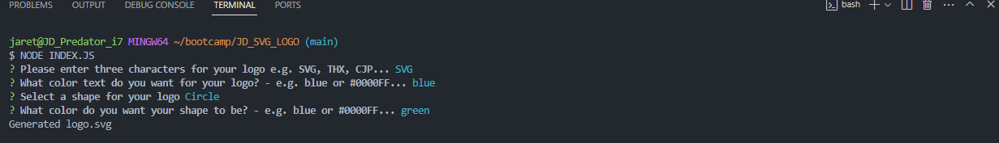

# JD_SVG_LOGO

## Description

This readme contains information on the SVG Logo Maker project. This SVG Logo maker allows users to generate their own logo. The user will answer questions regarding text, text color, shape color, and shape. The user input is then used to create the logo. 

## Installation

N/A

## Usage

In order to use this SVG Logo generator, the user must open the index.js file located in this repository and run the command "node index.js" in the terminal. The user is then given a series of questions to answer in order to generate the SVG logo. The logo.svg file will then be generated after answering all questions and the user can click on the newly created file to view their logo and open with browser. The user can open the index.js file in this repository and then enter the command "npm run test" in the terminal to display the total amount of tests passed.

## Links

Github repository URL: https://github.com/JarettDeSanti/JD_SVG_LOGO  
Demo URL: https://drive.google.com/file/d/1xevvxKHJz88Ms4nst1GZ2boSt3G6OQdf/view

## Screenshot

## Credits

## Acknowledgements 

Guidance with this project has been provided by tutor Corey Yates.

## License

Please refer to the LICENSE in the repository.

## Badges
N/A

## Features
N/A

## How to Contribute
N/A

## Tests
The user can open the index.js file in this repository and then enter the command "npm run test" in the terminal to display the total amount of tests passed.
